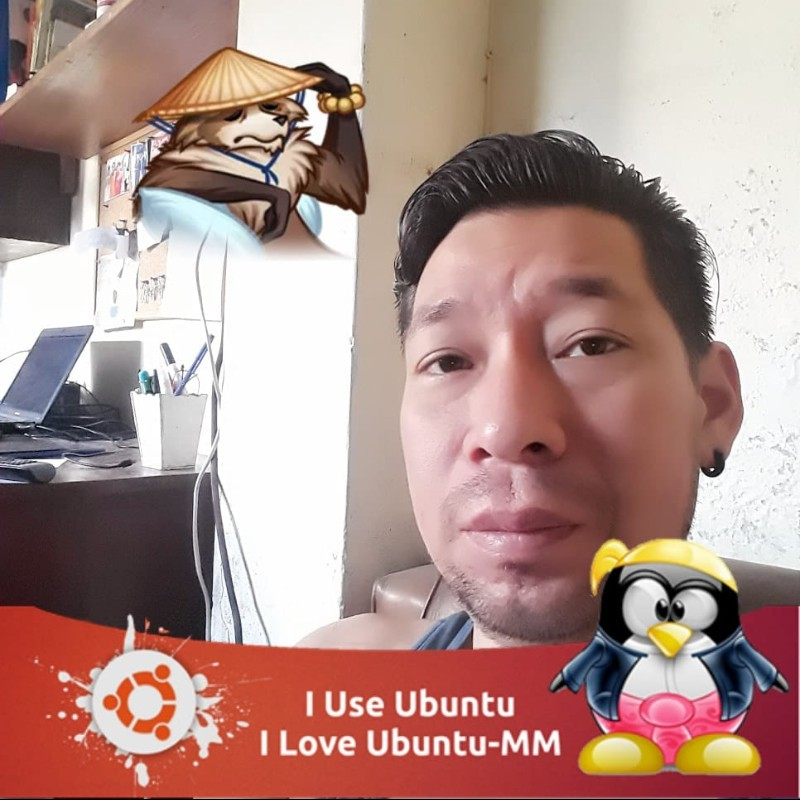

<p align="center" style="background-color: #fff; padding: 15px;">
    <a href="https://www.silabuz.com" target="_blank">
        
    </a>
</p>

## About this API

This API was developed as a technical challenge for the recruitment process by Silabuz.com, it was used:
- **[Laravel 10](https://laravel.com/docs/10.x)**
- **[Guzzle](https://docs.guzzlephp.org/en/stable/)**
- **[Passport](https://laravel.com/docs/10.x/passport)**
- **[Postman](https://documenter.getpostman.com/view/1866863/2s9YJaZ4Uw)**

This API queries an album and an artist by their ID from the Deezer API, and can also search for artists, albums, tracks, etc, to consume the tracks of this API, it is necessary to be registered and logged in the same API.


## Instalation

1. Clone the repository
```git
git clone https://github.com/danteCortes/silabuz.git
```
2. Enter the newly cloned project
```
cd silabuz
```
3. Install the composer packages.
```
composer install
```
4. Copy the .env.example file
```
cp .env.example .env
```
5. Configure the database environment variables in the .env file.
```
DB_CONNECTION=mysql
DB_HOST=127.0.0.1
DB_PORT=3306
DB_DATABASE=laravelchallenge
DB_USERNAME=root
DB_PASSWORD=1234
```
6. Execute the migrations to create the tables in the database.
```
php artisan migrate
```
7. Set the environment variable for the passport token in the .env file.
```
PASSPORT_TOKEN_NAME=silabuz
```
8. install the passport client.
```
php artisan passport:install
```
9.  Set the environment variable for the Deezer API path in the .env file.
```
DEEZER_ENDPOINT=https://api.deezer.com
```
10. Generate laravel application key.
```
php artisan key:generate
```
11. Start the laravel application.
```
php artisan serve
```

## Postman documentacion

The documentation of the routes is published in **Postman** in the following link:
[https://documenter.getpostman.com/view/1866863/2s9YJaZ4Uw](https://documenter.getpostman.com/view/1866863/2s9YJaZ4Uw)

<div align="center">

</div>

## Author

<div align='center'>
  
  <h1>Dante Esteban Cortés Ganoza</h1>
</div>

Hello, my name is **Dante Esteban Cortés Ganoza**, I am a full Stack Developer with 9 years of experience developing different web applications, from point of sale for stores to electronic billing systems and systems for educational institutions, My experience in backend Developer is 10 years with PHP and its frameworks Laravel and Symfony in addition to developing small API's with Node.js. And my experience in frontend Developer is from 7 years ago starting with Vue, React and lately with Angular. The databases I managed are MySQL, SQL Server, PostgreSQL and Mongo DB. All the projects I worked on were deployed on virtual servers with Ubuntu server by myself, these servers are usually from digital ocean, heroku, AWS and once I used an Azure application for deployment.

I hope to deliver a product up to your expectations and to be considered for the end of the recruitment process for the Backend Developer vacancy.

It was a fun challenge, and although I did not get to complete everything I wanted to implement, I am glad that the application is functional and, most of all, to have participated in this challenge. I thank you very much for taking me into account up to this point in the recruitment process and I look forward to working with you, this challenge showed me the professionalism with which you are used to work and I am excited about all the experience I will be able to absorb thanks to your work culture.

Again, Thank you silabuz.com for the opportunity.

Best regards, Dante Cortés.